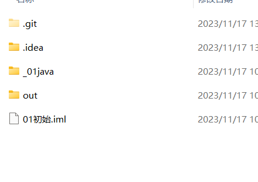

一个项目下由许多个模块组件创建方式
一个项目下可以创建包 包就是多级的模块 如：com.itheima.abc 在盘符中就查看到com文件下的itheima文件下的abc
现在我们的代码就是写在包里面
psvm是快捷生成java类的结构内容的方法

idea的项目结构 project>module>package>class
projec：
module：
package：class直接上级目录

idea的常见插件
https://zhuanlan.zhihu.com/p/410613271

ctrl+shirt+逗号一键生成javabean类

map set list 的关系图

